```mermaid
flowchart TB
    subgraph current["Clientes.WebApi.csproj"]
        MAIN["<b>⚙️&nbsp;Clientes.WebApi.csproj</b><br/><small>net481</small>"]
        click MAIN "#clienteswebapiclienteswebapicsproj"
    end

```

# Projects and dependencies analysis

This document provides a comprehensive overview of the projects and their dependencies in the context of upgrading to .NETCoreApp,Version=v10.0.

## Table of Contents

- [Executive Summary](#executive-Summary)
  - [Highlevel Metrics](#highlevel-metrics)
  - [Projects Compatibility](#projects-compatibility)
  - [Package Compatibility](#package-compatibility)
  - [API Compatibility](#api-compatibility)
- [Aggregate NuGet packages details](#aggregate-nuget-packages-details)
- [Top API Migration Challenges](#top-api-migration-challenges)
  - [Technologies and Features](#technologies-and-features)
  - [Most Frequent API Issues](#most-frequent-api-issues)
- [Projects Relationship Graph](#projects-relationship-graph)
- [Project Details](#project-details)

  - [Clientes.WebApi\Clientes.WebApi.csproj](#clienteswebapiclienteswebapicsproj)

## Executive Summary

### Highlevel Metrics

| Metric | Count | Status |
| :--- | :---: | :--- |
| Total Projects | 1 | All require upgrade |
| Total NuGet Packages | 17 | 6 need upgrade |
| Total Code Files | 12 |  |
| Total Code Files with Incidents | 6 |  |
| Total Lines of Code | 425 |  |
| Total Number of Issues | 92 |  |
| Estimated LOC to modify | 75+ | at least 17,6% of codebase |

### Projects Compatibility

| Project | Target Framework | Difficulty | Package Issues | API Issues | Est. LOC Impact | Description |
| :--- | :---: | :---: | :---: | :---: | :---: | :--- |
| [Clientes.WebApi\Clientes.WebApi.csproj](#clienteswebapiclienteswebapicsproj) | net481 | 🔴 High | 12 | 75 | 75+ | Wap, Sdk Style = False |

### Package Compatibility

| Status | Count | Percentage |
| :--- | :---: | :---: |
| ✅ Compatible | 11 | 64,7% |
| ⚠️ Incompatible | 3 | 17,6% |
| 🔄 Upgrade Recommended | 3 | 17,6% |
| ***Total NuGet Packages*** | ***17*** | ***100%*** |

### API Compatibility

| Category | Count | Impact |
| :--- | :---: | :--- |
| 🔴 Binary Incompatible | 68 | High - Require code changes |
| 🟡 Source Incompatible | 7 | Medium - Needs re-compilation and potential conflicting API error fixing |
| 🔵 Behavioral change | 0 | Low - Behavioral changes that may require testing at runtime |
| ✅ Compatible | 315 |  |
| ***Total APIs Analyzed*** | ***390*** |  |

## Aggregate NuGet packages details

| Package | Current Version | Suggested Version | Projects | Description |
| :--- | :---: | :---: | :--- | :--- |
| Autofac | 8.4.0 |  | [Clientes.WebApi.csproj](#clienteswebapiclienteswebapicsproj) | ✅Compatible |
| Autofac.WebApi2 | 6.2.0 |  | [Clientes.WebApi.csproj](#clienteswebapiclienteswebapicsproj) | ⚠️NuGet package is incompatible |
| EntityFramework | 6.5.1 |  | [Clientes.WebApi.csproj](#clienteswebapiclienteswebapicsproj) | ✅Compatible |
| Microsoft.AspNet.WebApi | 5.3.0 |  | [Clientes.WebApi.csproj](#clienteswebapiclienteswebapicsproj) | NuGet package functionality is included with framework reference |
| Microsoft.AspNet.WebApi.Client | 6.0.0 |  | [Clientes.WebApi.csproj](#clienteswebapiclienteswebapicsproj) | ✅Compatible |
| Microsoft.AspNet.WebApi.Core | 5.3.0 |  | [Clientes.WebApi.csproj](#clienteswebapiclienteswebapicsproj) | ⚠️NuGet package is incompatible |
| Microsoft.AspNet.WebApi.WebHost | 5.3.0 |  | [Clientes.WebApi.csproj](#clienteswebapiclienteswebapicsproj) | ⚠️NuGet package is incompatible |
| Microsoft.Bcl.AsyncInterfaces | 8.0.0 | 10.0.1 | [Clientes.WebApi.csproj](#clienteswebapiclienteswebapicsproj) | NuGet package upgrade is recommended |
| Microsoft.CodeDom.Providers.DotNetCompilerPlatform | 2.0.1 |  | [Clientes.WebApi.csproj](#clienteswebapiclienteswebapicsproj) | NuGet package functionality is included with framework reference |
| Newtonsoft.Json | 13.0.4 |  | [Clientes.WebApi.csproj](#clienteswebapiclienteswebapicsproj) | ✅Compatible |
| Newtonsoft.Json.Bson | 1.0.2 |  | [Clientes.WebApi.csproj](#clienteswebapiclienteswebapicsproj) | ✅Compatible |
| System.Buffers | 4.5.1 |  | [Clientes.WebApi.csproj](#clienteswebapiclienteswebapicsproj) | NuGet package functionality is included with framework reference |
| System.Diagnostics.DiagnosticSource | 8.0.1 | 10.0.1 | [Clientes.WebApi.csproj](#clienteswebapiclienteswebapicsproj) | NuGet package upgrade is recommended |
| System.Memory | 4.5.5 |  | [Clientes.WebApi.csproj](#clienteswebapiclienteswebapicsproj) | NuGet package functionality is included with framework reference |
| System.Numerics.Vectors | 4.5.0 |  | [Clientes.WebApi.csproj](#clienteswebapiclienteswebapicsproj) | NuGet package functionality is included with framework reference |
| System.Runtime.CompilerServices.Unsafe | 6.0.0 | 6.1.2 | [Clientes.WebApi.csproj](#clienteswebapiclienteswebapicsproj) | NuGet package upgrade is recommended |
| System.Threading.Tasks.Extensions | 4.5.4 |  | [Clientes.WebApi.csproj](#clienteswebapiclienteswebapicsproj) | NuGet package functionality is included with framework reference |

## Top API Migration Challenges

### Technologies and Features

| Technology | Issues | Percentage | Migration Path |
| :--- | :---: | :---: | :--- |
| ASP.NET Framework (System.Web) | 70 | 93,3% | Legacy ASP.NET Framework APIs for web applications (System.Web.*) that don't exist in ASP.NET Core due to architectural differences. ASP.NET Core represents a complete redesign of the web framework. Migrate to ASP.NET Core equivalents or consider System.Web.Adapters package for compatibility. |

### Most Frequent API Issues

| API | Count | Percentage | Category |
| :--- | :---: | :---: | :--- |
| M:System.Web.Http.RouteAttribute.#ctor(System.String) | 6 | 8,0% | Binary Incompatible |
| T:System.Web.Http.RouteAttribute | 6 | 8,0% | Binary Incompatible |
| M:System.Web.Http.HttpGetAttribute.#ctor | 5 | 6,7% | Binary Incompatible |
| T:System.Web.Http.HttpGetAttribute | 5 | 6,7% | Binary Incompatible |
| T:System.Web.Http.Results.NotFoundResult | 4 | 5,3% | Binary Incompatible |
| M:System.Web.Http.ApiController.NotFound | 4 | 5,3% | Binary Incompatible |
| M:System.Web.Http.ApiController.#ctor | 3 | 4,0% | Binary Incompatible |
| T:System.Web.Http.RouteParameter | 3 | 4,0% | Binary Incompatible |
| T:System.Web.Http.ApiController | 2 | 2,7% | Binary Incompatible |
| T:System.Web.Http.GlobalConfiguration | 2 | 2,7% | Binary Incompatible |
| T:System.Web.Http.HttpConfiguration | 2 | 2,7% | Binary Incompatible |
| P:System.Net.Http.Formatting.BaseJsonMediaTypeFormatter.SerializerSettings | 2 | 2,7% | Source Incompatible |
| T:System.Web.Http.IHttpActionResult | 1 | 1,3% | Binary Incompatible |
| M:System.Web.Http.RoutePrefixAttribute.#ctor(System.String) | 1 | 1,3% | Binary Incompatible |
| T:System.Web.Http.RoutePrefixAttribute | 1 | 1,3% | Binary Incompatible |
| M:System.Web.Http.FromBodyAttribute.#ctor | 1 | 1,3% | Binary Incompatible |
| T:System.Web.Http.FromBodyAttribute | 1 | 1,3% | Binary Incompatible |
| M:System.Web.Http.HttpPostAttribute.#ctor | 1 | 1,3% | Binary Incompatible |
| T:System.Web.Http.HttpPostAttribute | 1 | 1,3% | Binary Incompatible |
| M:System.Web.Http.HttpDeleteAttribute.#ctor | 1 | 1,3% | Binary Incompatible |
| T:System.Web.Http.HttpDeleteAttribute | 1 | 1,3% | Binary Incompatible |
| T:System.Web.Http.Results.OkResult | 1 | 1,3% | Binary Incompatible |
| M:System.Web.Http.ApiController.Ok | 1 | 1,3% | Binary Incompatible |
| M:System.Web.Http.FromUriAttribute.#ctor | 1 | 1,3% | Binary Incompatible |
| T:System.Web.Http.FromUriAttribute | 1 | 1,3% | Binary Incompatible |
| M:System.Web.Http.GlobalConfiguration.Configure(System.Action{System.Web.Http.HttpConfiguration}) | 1 | 1,3% | Binary Incompatible |
| M:System.Web.HttpApplication.#ctor | 1 | 1,3% | Source Incompatible |
| T:System.Web.HttpApplication | 1 | 1,3% | Source Incompatible |
| F:System.Web.Http.RouteParameter.Optional | 1 | 1,3% | Binary Incompatible |
| T:System.Web.Http.HttpRouteCollection | 1 | 1,3% | Binary Incompatible |
| P:System.Web.Http.HttpConfiguration.Routes | 1 | 1,3% | Binary Incompatible |
| T:System.Web.Http.HttpRouteCollectionExtensions | 1 | 1,3% | Binary Incompatible |
| T:System.Web.Http.Routing.IHttpRoute | 1 | 1,3% | Binary Incompatible |
| M:System.Web.Http.HttpRouteCollectionExtensions.MapHttpRoute(System.Web.Http.HttpRouteCollection,System.String,System.String,System.Object) | 1 | 1,3% | Binary Incompatible |
| T:System.Web.Http.HttpConfigurationExtensions | 1 | 1,3% | Binary Incompatible |
| M:System.Web.Http.HttpConfigurationExtensions.MapHttpAttributeRoutes(System.Web.Http.HttpConfiguration) | 1 | 1,3% | Binary Incompatible |
| T:System.Net.Http.Formatting.MediaTypeFormatterCollection | 1 | 1,3% | Source Incompatible |
| P:System.Web.Http.HttpConfiguration.Formatters | 1 | 1,3% | Binary Incompatible |
| T:System.Net.Http.Formatting.JsonMediaTypeFormatter | 1 | 1,3% | Source Incompatible |
| P:System.Net.Http.Formatting.MediaTypeFormatterCollection.JsonFormatter | 1 | 1,3% | Source Incompatible |
| P:System.Web.Http.GlobalConfiguration.Configuration | 1 | 1,3% | Binary Incompatible |
| T:System.Web.Http.Dependencies.IDependencyResolver | 1 | 1,3% | Binary Incompatible |
| P:System.Web.Http.HttpConfiguration.DependencyResolver | 1 | 1,3% | Binary Incompatible |

## Projects Relationship Graph

Legend:
📦 SDK-style project
⚙️ Classic project

## Project Details

### Clientes.WebApi\Clientes.WebApi.csproj

#### Project Info

- **Current Target Framework:** net481
- **Proposed Target Framework:** net10.0
- **SDK-style**: False
- **Project Kind:** Wap
- **Dependencies**: 0
- **Dependants**: 0
- **Number of Files**: 14
- **Number of Files with Incidents**: 6
- **Lines of Code**: 425
- **Estimated LOC to modify**: 75+ (at least 17,6% of the project)

#### Dependency Graph

Legend:
📦 SDK-style project
⚙️ Classic project

### API Compatibility

| Category | Count | Impact |
| :--- | :---: | :--- |
| 🔴 Binary Incompatible | 68 | High - Require code changes |
| 🟡 Source Incompatible | 7 | Medium - Needs re-compilation and potential conflicting API error fixing |
| 🔵 Behavioral change | 0 | Low - Behavioral changes that may require testing at runtime |
| ✅ Compatible | 315 |  |
| ***Total APIs Analyzed*** | ***390*** |  |

#### Project Technologies and Features

| Technology | Issues | Percentage | Migration Path |
| :--- | :---: | :---: | :--- |
| ASP.NET Framework (System.Web) | 70 | 93,3% | Legacy ASP.NET Framework APIs for web applications (System.Web.*) that don't exist in ASP.NET Core due to architectural differences. ASP.NET Core represents a complete redesign of the web framework. Migrate to ASP.NET Core equivalents or consider System.Web.Adapters package for compatibility. |

